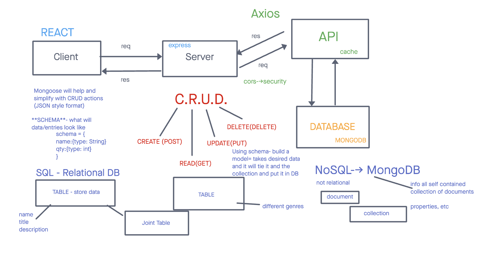

# Can of Books

**Author**: Shania Kimbrough, Ian Cargill, Brandon Mizutani
**Version**: 1.0.0 (Netlify: [Netlify](https://mizutani-can-of-books.netlify.app/) | Trello: [Can of Books](https://trello.com/b/meRpcJGP/can-of-books) | Heroku: [Heroku](https://paperlouse-can-of-books.herokuapp.com/))

## Overview

This application, Can of Books, implements a NoSQL database called MongoDB. It enables the passing down of unique documents of data in the form of collections.

## Getting Started

**Step 1: Set Up**
Logistical

* What hours will you be available to communicate?
    Class hours or via slack

* What platform will you use to communicate (ie. Slack, phone …)?
    Slack, Computer, Phone
* How often will you take breaks?
    Once every hour
* What is your plan if you start to fall behind?
    We don’t believe we will run into that problem, but if so, we will help each other out or ask for assistance.

Cooperative

* Make a list of each person’s strengths.
    Shania: Basic JavaScript
    Brandon: BootStrap, CSS
    Ian C: MongoDB
* How can you best utilize these strengths in the development of your application?
    Styling, Functionality, and implementing data, NoSQl, via MongoDB
* In what areas do you each want to develop greater strength?
    Shania: Backend development
    Brandon: NoSQL
    Ian C: Stylization via CSS and BootStrap

* Knowing that every person in your team needs to understand the code, how do you plan to approach the day-to-day development?
    Tackle tasks via Trello and discussing code to insure no breaking in code.

Conflict Resolution

* What will your team do if one person is pulling all the weight while the other person is not contributing?
    Communicate with one another if said issue like that occurs.
* What will your team do if one person is taking over the project and not letting the other member contribute?
    Communicate with one another if said issue like that occurs. If the problem continues, perhaps mute them?
* How will you approach each other and the challenge of building an application knowing that it is impossible for two people to be at the exact same place in understanding and skill level?
    Discuss each block of code so that we all as a group can go over complicated material in order to be on the same page.

WhiteBoard Lab 11: 

## Architecture

-Bootstrap
-JavaScript
-State and Props
-NoSQL (MongoDB)
-REACT.JS

## Change Log

## Estimates

Name of feature: frontend-lab-11

Estimate of time needed to complete: 5 hours

Start time: Saturday 6:00pm

Finish time: Tuesday 7:34

Actual time needed to complete: 7 hours (Refracturing)

## Credit and Collaborations

JP Jones
TA's